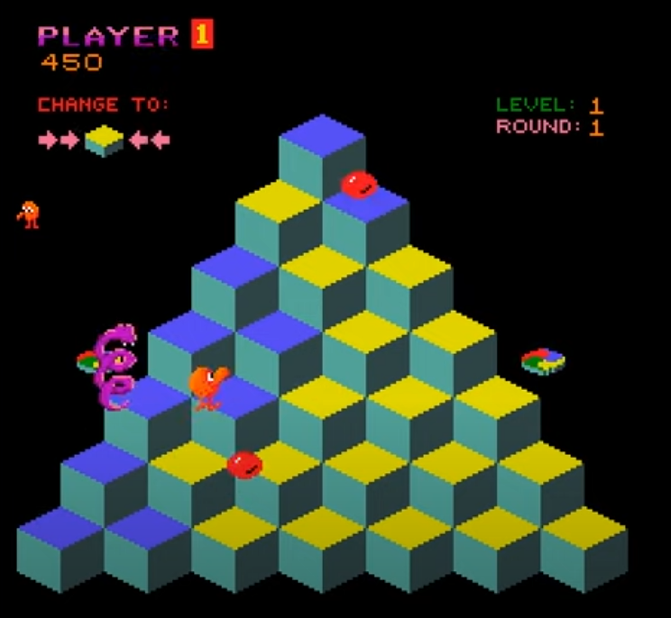

# q-bert
Implementation of Q*Bert in Haskell using brick.

## Instructions

* Compile with `stack build`
* Play with `stack run`
* 
## TODO

- [ ] Convert starter code to work with q-bert logic

# Proposal
We aim to implement a simple version of the classic retro game Q*Bert in Haskell using the [brick](https://github.com/jtdaugherty/brick/) library.

The goal of the game is to hop on all of the cubes in the map while avoiding enemies that can travel in varying ways (some enemies can even travel sideways!) The player can use spinners located on the sides of the map to skillfully evade enemies and reach opposite ends of the map quickly. Progressing through the levels will make the game more challenging and interesting; the color palette of the map may change, and enemies may appear more frequently. The player's final score depends on how far they make it before losing all of their lives, and they may have the option to register their score on a high-score leaderboard with a custom name if they choose to do so.

# Milestone 2

* **What is the architecture of your application (the key components)?**

The key components are the model, view, and control components, as in the starter code. For our project, the model contains a board with player and enemy (bean/snake) positions, and handles win/lose logic based on whether the player has captured all the tiles or collided with an enemy. The control component handles player input (moving up/down/left/right) and updates enemy movements every tick. The view component draws everything every tick, and displays where the player and enemies are as well as which tiles have been captured/yet to be captured.

* **What challenges (if any) did you have so far and how did you solve them?**

We initially had trouble figuring out how to implement a working gameloop into the starter code so that the game could advance enemy movement without player input, and we solved it by referencing the [snake](https://github.com/samtay/snake) game repo with the provided [tutorial to brick](https://samtay.github.io/posts/introduction-to-brick) which was very helpful. After finishing all the game logic, we hope to change the view logic (if it turns out to be possible) so that the tiles are drawn isometrically as in the original game, which is likely our next challenge.

* **Do you expect to meet your goals until the deadline?**

We expect to be able to implement a working prototype where the player can capture squares while avoiding enemies, and loses upon colliding with an enemy and wins upon capturing all the squares. We are not entirely sure if we are able to implement the isometric view, though we will try.

* **If not, how will you modify your goals?**

We will not implement the isometric view if it turns out to be too time-consuming/difficult, but we will still have a working prototype of q-bert. We will have at least a win/lose screen to indicate whether the player has won or lost.

# Team members

The contributors to this repository are Daniel Tan, Ethan Nagola, and Xiaofan Lin.
