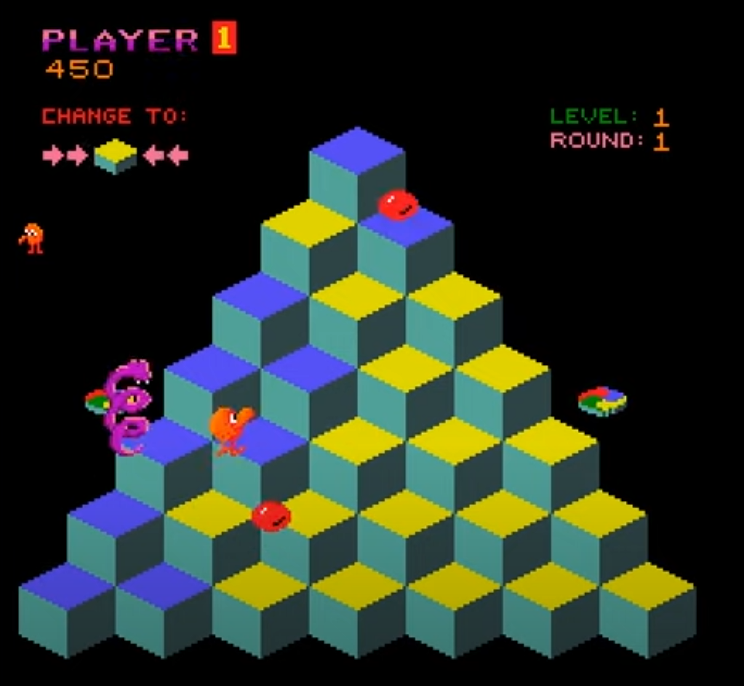

# q-bert
Implementation of Q*Bert in Haskell using brick.

# Proposal
We aim to implement a simple version of the classic retro game Q*Bert in Haskell using the [brick](https://github.com/jtdaugherty/brick/) library.

The goal of the game is to hop on all of the cubes in the map while avoiding enemies that can travel in varying ways (some enemies can even travel sideways!) The player can use spinners located on the sides of the map to skillfully evade enemies and reach opposite ends of the map quickly. Progressing through the levels will make the game more challenging and interesting; the color palette of the map may change, and enemies may appear more frequently. The player's final score depends on how far they make it before losing all of their lives, and they may have the option to register their score on a high-score leaderboard with a custom name if they choose to do so.

# Team members

The contributors to this repository are Daniel Tan, Ethan Nagola, and Xiaofan Lin.
